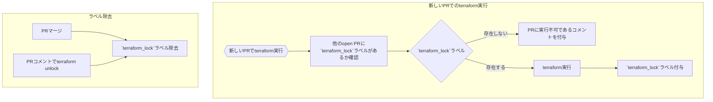

:::message
この記事はFinatextグループ10周年記念アドベントカレンダーの7日目の記事です。
昨日はToddさんが「●●●●」という記事を公開しています。
:::

# はじめに
Terraformを導入してIaC化をしたのちに、IaCのコードレビューの仕組み、安全なTerraform Applyの仕組みを構築することが必要になります。

執筆現在、私が所属しているFinatextグループのナウキャストでは[Atlantis](https://www.runatlantis.io/)というTerraformのPlanやApplyをGithub Pull Request上で制御できるツールを用いて、レビューから適用まで楽に運用ができるようになっています。
ref: [Snowflake×dbt×Terraformでモダンなデータ基盤開発してみた](https://techblog.finatext.com/snowflake-dbt-terraform-15615b020857)

ただ、Atlantisを利用するためには自前でAtlantisのサーバーを立てる必要があり、そのためにはサーバーの管理や運用が必要になります。

社内でのリソースの確保や運用のための人員の確保が難しい場合には、Atlantisを利用することを諦めてしまうこともあるかと思います。
今回はよりスモールにGitHub ActionsのみでAtlantis likeなTerraformのCICDの仕組みを構築する方法を紹介します。

# ユースケース
今回は複数のGoogle Cloud のプロジェクトを管理するために、TerraformのCICDの仕組みを構築します。

管理するプロジェクト構成としては以下のような構成を想定しています。
二つのプロジェクトはすでに存在しているものとします。

- project-a-dev
- project-b-prod

なお、Terraformのディレクトリ構成はprojectごとにディレクトリを分け、その中にprojectごとのTerraformのコードを配置するようにしています。
またブランチ戦略としては、mainブランチのみの運用とします。
ex. project-a-devのTerraformコードは`environments/project-a-dev`に配置する。その内容を反映させたい場合、mainブランチに対してPRを作成する。

```ディレクトリ構成
root/environments  
├ project-a-dev
└ project-b-prod
```

# Terraform Planの実行
Terraform PlanはPRが作成された時(と新たなpushが生じた時)とPRのコメント上で`terraform plan [project名]`と入力された時に実行されるようにします。
また、Terraform Planの実行結果はPRのコメント上に追記されるようにします。
```yaml
jobs:
  terraform_plan:
    name: Terraform Plan
    runs-on: ubuntu-latest
    permissions:
      id-token: write
      contents: read
      pull-requests: write
    defaults:
      run:
        working-directory: "environments/${{inputs.project}}/" # プロジェクトごとにディレクトリを分けている
    steps:
      - name: Checkout Repo
        if: github.event_name == 'pull_request'
        uses: actions/checkout@v2

      - name: Checkout Repo
        if: github.event_name == 'issue_comment'
        uses: actions/checkout@v2
        with:
          ref: refs/pull/${{ github.event.issue.number }}/merge

      - name: Get PR Number
        id: get-pr-number
        run: |
          if [[ "${{ github.event_name }}" == "pull_request" ]]; then
            echo "pr_number=${{ github.event.number }}" >> "$GITHUB_OUTPUT"
          elif [ "${{ github.event_name }}" == "issue_comment" ]; then
            echo "pr_number=${{ github.event.issue.number }}" >> "$GITHUB_OUTPUT"
          fi

      - name: Authenticate to GCP
        uses: google-github-actions/auth@v2
        with:
          create_credentials_file: true
          workload_identity_provider: ${{ secrets.WORKLOAD_IDENTITY_PROVIDER }}
          service_account: ${{ secrets.SERVICE_ACCOUNT }}

      - name: Setup Terraform
        uses: hashicorp/setup-terraform@v3

      - name: Terraform Plan
        id: plan
        if: steps.lock-check.outputs.locked == 'false'
        run: |
          echo "plan_output_path=$(pwd)/plan_output.txt" >> "$GITHUB_OUTPUT"
          terraform plan -no-color > plan_output.txt 2>&1

      - name: Comment Plan Result on PR
        if: always() && steps.lock-check.outputs.locked == 'false'
        uses: actions/github-script@v5
        with:
          script: |
            const fs = require('fs');
            const planOutput = fs.readFileSync('${{ steps.plan.outputs.plan_output_path }}', 'utf8');
            const commentBody = `
            Ran Plan for dir: \`${{inputs.project}}\`
            <details>

            <summary>Show Output</summary>

            \`\`\`
            ${planOutput}
            \`\`\`

            </details>

            To apply this plan, comment: \`terraform apply ${{inputs.project}}\`
            To plan this project again, comment: \`terraform plan ${{inputs.project}}\`
            `;
            github.rest.issues.createComment({
              issue_number: context.issue.number,
              owner: context.repo.owner,
              repo: context.repo.repo,
              body: commentBody
            });
```

# Terraform Applyの実行
Terraform ApplyはApproveされたPRのコメント上で`terraform apply [project名]`と入力された時に実行されるようにします。
Terraform Planと同様にTerraform Applyの実行結果はPRのコメント上に追記されるようにします。
```yaml
jobs:
  terraform_apply:
    name: Terraform Apply
    runs-on: ubuntu-latest
    permissions:
      id-token: write
      contents: read
      pull-requests: write
    defaults:
      run:
        working-directory: "environments/${{inputs.project}}/"
    steps:
      - name: Checkout Repo
        if: github.event_name == 'issue_comment'
        uses: actions/checkout@v2
        with:
          ref: refs/pull/${{ github.event.issue.number }}/merge

      - name: Check PR Approval Status
        id: check-pr-status
        uses: actions/github-script@v5
        with:
          script: |
            const { data: reviews } = await github.rest.pulls.listReviews({
            owner: context.repo.owner,
            repo: context.repo.repo,
            pull_number: context.issue.number
             });
            const RequestChanges = reviews.some(review => review.state === 'CHANGES_REQUESTED');
            const Approved = !RequestChanges && reviews.some(review => review.state === 'APPROVED');

            core.setOutput('approved', Approved);

      - name: Comment and exit if not approved
        if: steps.check-pr-status.outputs.approved == 'false'
        uses: actions/github-script@v5
        with:
          script: |
            await github.rest.issues.createComment({
            issue_number: context.issue.number,
            owner: context.repo.owner,
            repo: context.repo.repo,
            body: 'Failed: Pull request is not approved.'
            });

            process.exit(1);

      - name: Authenticate to GCP
        uses: google-github-actions/auth@v2
        with:
          create_credentials_file: true
          workload_identity_provider: ${{ secrets.WORKLOAD_IDENTITY_PROVIDER }}
          service_account: ${{ secrets.SERVICE_ACCOUNT }}

      - name: Setup Terraform
        uses: hashicorp/setup-terraform@v3

      - name: Terraform Init
        run: terraform init -no-color

      - name: Terraform Apply
        id: apply
        if: steps.lock-check.outputs.locked == 'false' && steps.check-pr-status.outputs.approved == 'true'
        run: |
          echo "apply_output_path=$(pwd)/apply_output.txt" >> "$GITHUB_OUTPUT"
          terraform apply -auto-approve -no-color > apply_output.txt 2>&1

      - name: Comment Apply Result on PR
        if: always() && steps.lock-check.outputs.locked == 'false' && steps.check-pr-status.outputs.approved == 'true'
        uses: actions/github-script@v5
        with:
          script: |
            const fs = require('fs');
            const applyOutput = fs.readFileSync('${{ steps.apply.outputs.apply_output_path }}', 'utf8');
            const commentBody = `
            Ran Apply for dir: \`${{inputs.project}}\`
            <details>

            <summary>Show Output</summary>

            \`\`\`
            ${applyOutput}
            \`\`\`

            </details>
            `;
            github.rest.issues.createComment({
              issue_number: context.issue.number,
              owner: context.repo.owner,
              repo: context.repo.repo,
              body: commentBody
            });
```


# Terraformのロック機構
以上でGitHub ActionsのみでTerraformのCICDの仕組みを構築することができました。
しかし、上記のままであれば複数人が同時にTerraform Apply, Planを実行してしまうと、競合が発生してしまい、危険です。

例えばある人がTerraform Planを実行してレビューしている最中に、別の人がTerraform Applyを実行してしまうと、Planの内容とApplyの内容に齟齬が生まれてしまいます。
そのためTerraformの実行を制限するロック機構の仕組みが必要です。
チームで活発にTerraformを用いてインフラを管理していく上ではTerraformのロック機構の構築は必要と思います。

今回、Terraform実行のロック機構で以下の3つの仕組みを採用・構築しました。
- Terraform state locking
- GitHub Actions jobの同時実行の排他制御
- labelを使用したPRごとのロック機構

## Terraform state locking
こちらはTerraformの標準機能で、Terraformのstateファイルをロックする機能です。
これにより、複数人が同時にTerraform Apply, Planを実行することを防ぐことができます。
state locking機能を利用するためには、state lockingに対応したbackendを指定する必要があります。

今回の構成では、Google Cloud Storage (GCS)を利用したbackendを利用しています。GCSはstate lockingに対応しているため、state locking機能を利用することができます。

[Backend Type: gcs | Terraform | HashiCorp Developer](https://developer.hashicorp.com/terraform/language/settings/backends/gcs)

## GitHub Actions jobの同時実行の排他制御
こちらはGitHub Actionsの標準機能で、同時に実行されるjobの数を制限する機能です。

[Using concurrency - GitHub Docs](https://docs.github.com/en/actions/using-jobs/using-concurrency)

簡単にまとめると以下のような機能です。
- group
  - タグのようなものでワークフローの実行をグループ化するための識別子。
  - このグループ名がついているものは、同時に実行されない。

- cancel-in-progress(True or False)
  - True
    - 同じグループ内で新しいワークフローがトリガーされると、進行中のワークフローがキャンセルされる。
  - False
    - 新しいワークフローが待機し、既存のワークフローが完了するまで実行されない。
    - 同じグループ内でCICDが同時に実行されることはなくなるが、jobの成功、失敗にかかわらずワークフローが終了すると後続のワークフローが動き出す。

今回は
- 同じprojectのplan, applyを同一groupに設定
  - project-a-dev
  - project-b-prod
- cancel-in-progressをFalseに設定

としました。
この設定により、同じprojectのplan, applyは同時に実行されないようになります。

## labelを使用したPRごとのロック機構
こちらはAtlantisのLocking機能を参考にしました。
そもそもなぜPRごとのlock機能が必要かはAtlantisのドキュメントに書かれています。

[Locking | Atlantis](https://www.runatlantis.io/docs/locking.html)

今回Terraform Apllyの実行はmainブランチに対してPRがmergeされた時ではなく、PRがApproveされた時に実行されるようにしました。
となるとmainブランチのTerraformのコードと実際のインフラの状態が異なってしまう可能性があります。
実際にこの状態が不健全と考え、Terraform ApplyのタイミングはPRがmergeされたときに実行される方もいらっしゃるかと思います。
しかし、Terraform Applyは失敗することが度々あり(Terraform planやvalidateはOKでも)、その検知はPRがmergeされた後になってしまいます。となるとdurtyなTerraformのコードがmainブランチに存在することになる、また修正のPRを追加で用意する必要が出てきます。
なので、Terraform ApplyはPRがmergeされる前にPRのコメント追加をトリガーに実行されるのみとしました。

ただ、何の制限もなくPRでTerraform Applyを実行できてしまうと危険なのでApproveされたPRでのみTerraform Applyを実行できない制限と追加で、PRごとにlabelを用いたTerraformのlock機能を構築しました。

以下がlabelを用いたPRごとのlock機能の仕組みです。
- Terraform Planが実行されるとそのPRに対して`terraform_lock`というラベルが付与される
- もし違うPRでterraform plan or terraform applyが実行されようとしたら他のopenなPRに対して`terraform_lock`ラベルがついてないか確認する。付いていたらcancel、付いてなかったら実行、`terraform_lock`のラベルを付与
- `terraform_apply`ラベルがついたPRならterraform applyは実行できる、mainブランチにmergeされたら`terraform_lock`ラベルは除去される
- もしあるPRから`terraform_lock`ラベルを除去したかったらPRのコメントで`terraform unlock`と入力したら除去される



以下は実際の実装です。(planもapplyも同じような実装です)
```yaml
jobs:
  terraform_plan:
    name: Terraform Plan
    runs-on: ubuntu-latest
    permissions:
      id-token: write
      contents: read
      pull-requests: write
    defaults:
      run:
        working-directory: "environments/${{inputs.project}}/"
    steps:
      - name: Checkout Repo
        if: github.event_name == 'pull_request'
        uses: actions/checkout@v2

      - name: Checkout Repo
        if: github.event_name == 'issue_comment'
        uses: actions/checkout@v2
        with:
          ref: refs/pull/${{ github.event.issue.number }}/merge
      - name: Get PR Number
        id: get-pr-number
        run: |
          if [[ "${{ github.event_name }}" == "pull_request" ]]; then
            echo "pr_number=${{ github.event.number }}" >> "$GITHUB_OUTPUT"
          elif [ "${{ github.event_name }}" == "issue_comment" ]; then
            echo "pr_number=${{ github.event.issue.number }}" >> "$GITHUB_OUTPUT"
          fi

      - name: Check for 'terraform_lock' labels on other PRs
        id: lock-check
        run: |
          LOCKED_PRS=$(curl -H "Authorization: token ${{ secrets.GITHUB_TOKEN }}" \
              "https://api.github.com/repos/${{ github.repository }}/pulls?state=open" | \
              jq -r "[.[] | select(.number != ${{ steps.get-pr-number.outputs.pr_number }}) | select(.labels[].name == \"terraform_lock\") | {number: .number, html_url: .html_url}] | @json")
          echo "LOCKED_PRS=$LOCKED_PRS" >> "$GITHUB_ENV"

          if [[ "$LOCKED_PRS" != "[]" ]]; then
              echo "locked=true" >> "$GITHUB_OUTPUT"
          else
              echo "locked=false" >> "$GITHUB_OUTPUT"
          fi

      - name: Comment and exit if locked
        if: steps.lock-check.outputs.locked == 'true'
        uses: actions/github-script@v5
        with:
          script: |
            const lockedPrs = JSON.parse(process.env.LOCKED_PRS);
            let commentBody = 'Failed: Another pull request is currently executing:';
            lockedPrs.forEach(pr => {
            commentBody += ` [#${pr.number}](${pr.html_url})`;
            });
            commentBody += '\n\nTo continue, please execute the `terraform unlock` command in the currently executing pull request:';
            lockedPrs.forEach(pr => {
                commentBody += ` [#${pr.number}](${pr.html_url})`;
            });
            await github.rest.issues.createComment({
            issue_number: context.issue.number,
            owner: context.repo.owner,
            repo: context.repo.repo,
            body: commentBody
            });

            process.exit(1);

      - name: Add 'terraform_lock' label to this PR
        if: steps.lock-check.outputs.locked == 'false'
        run: |
          curl -X POST -H "Authorization: token ${{ secrets.GITHUB_TOKEN }}" \
            -H "Content-Type: application/json" \
            "https://api.github.com/repos/${{ github.repository }}/issues/${{ steps.get-pr-number.outputs.pr_number }}/labels" \
            -d '{"labels": ["terraform_lock"]}'
```

以下は`terraform unlock`の実装です。
```yaml
jobs:
  remove-lock-label:
    if: github.event_name == 'pull_request' || (github.event_name == 'issue_comment' && github.event.comment.body == 'terraform unlock')
    runs-on: ubuntu-latest
    steps:
      - name: Get PR Number
        id: get-pr-number
        run: |
          if [[ "${{ github.event_name }}" == "pull_request" ]]; then
            echo "pr_number=${{ github.event.number }}" >> "$GITHUB_OUTPUT"
          elif [ "${{ github.event_name }}" == "issue_comment" ]; then
            echo "pr_number=${{ github.event.issue.number }}" >> "$GITHUB_OUTPUT"
          fi

      - name: Remove 'terraform_lock' label
        run: |
          curl -X DELETE -H "Authorization: token ${{ secrets.GITHUB_TOKEN }}" \
            "https://api.github.com/repos/${{ github.repository }}/issues/${{ steps.get-pr-number.outputs.pr_number}}/labels/terraform_lock"

```

# GitHub Actionsの全体
以上の設計をまとめたGitHub Actionsの全体は以下のようになります。
:::details CIの定義
```yaml:CI_workflow_base.yml
name: Terraform Plan base

on:
  workflow_call:
    inputs:
      project:
        required: true
        type: string
    secrets:
      WORKLOAD_IDENTITY_PROVIDER:
        required: true
      SERVICE_ACCOUNT:
        required: true

jobs:
  terraform_plan:
    name: Terraform Plan
    runs-on: ubuntu-latest
    permissions:
      id-token: write
      contents: read
      pull-requests: write
    defaults:
      run:
        working-directory: "environments/${{inputs.project}}/"
    steps:
      - name: Checkout Repo
        if: github.event_name == 'pull_request'
        uses: actions/checkout@v2

      - name: Checkout Repo
        if: github.event_name == 'issue_comment'
        uses: actions/checkout@v2
        with:
          ref: refs/pull/${{ github.event.issue.number }}/merge
      - name: Get PR Number
        id: get-pr-number
        run: |
          if [[ "${{ github.event_name }}" == "pull_request" ]]; then
            echo "pr_number=${{ github.event.number }}" >> "$GITHUB_OUTPUT"
          elif [ "${{ github.event_name }}" == "issue_comment" ]; then
            echo "pr_number=${{ github.event.issue.number }}" >> "$GITHUB_OUTPUT"
          fi

      - name: Check for 'terraform_lock' labels on other PRs
        id: lock-check
        run: |
          LOCKED_PRS=$(curl -H "Authorization: token ${{ secrets.GITHUB_TOKEN }}" \
              "https://api.github.com/repos/${{ github.repository }}/pulls?state=open" | \
              jq -r "[.[] | select(.number != ${{ steps.get-pr-number.outputs.pr_number }}) | select(.labels[].name == \"terraform_lock\") | {number: .number, html_url: .html_url}] | @json")
          echo "LOCKED_PRS=$LOCKED_PRS" >> "$GITHUB_ENV"

          if [[ "$LOCKED_PRS" != "[]" ]]; then
              echo "locked=true" >> "$GITHUB_OUTPUT"
          else
              echo "locked=false" >> "$GITHUB_OUTPUT"
          fi

      - name: Comment and exit if locked
        if: steps.lock-check.outputs.locked == 'true'
        uses: actions/github-script@v5
        with:
          script: |
            const lockedPrs = JSON.parse(process.env.LOCKED_PRS);
            let commentBody = 'Failed: Another pull request is currently executing:';
            lockedPrs.forEach(pr => {
            commentBody += ` [#${pr.number}](${pr.html_url})`;
            });
            commentBody += '\n\nTo continue, please execute the `terraform unlock` command in the currently executing pull request:';
            lockedPrs.forEach(pr => {
                commentBody += ` [#${pr.number}](${pr.html_url})`;
            });
            await github.rest.issues.createComment({
            issue_number: context.issue.number,
            owner: context.repo.owner,
            repo: context.repo.repo,
            body: commentBody
            });

            process.exit(1);

      - name: Add 'terraform_lock' label to this PR
        if: steps.lock-check.outputs.locked == 'false'
        run: |
          curl -X POST -H "Authorization: token ${{ secrets.GITHUB_TOKEN }}" \
            -H "Content-Type: application/json" \
            "https://api.github.com/repos/${{ github.repository }}/issues/${{ steps.get-pr-number.outputs.pr_number }}/labels" \
            -d '{"labels": ["terraform_lock"]}'

      - name: Authenticate to GCP
        uses: google-github-actions/auth@v2
        with:
          create_credentials_file: true
          workload_identity_provider: ${{ secrets.WORKLOAD_IDENTITY_PROVIDER }}
          service_account: ${{ secrets.SERVICE_ACCOUNT }}

      - name: Setup Terraform
        uses: hashicorp/setup-terraform@v3

      - name: Terraform Init
        run: terraform init -no-color

      - name: Terraform Format
        run: terraform fmt -recursive -check

      - name: Terraform Validate
        run: terraform validate -no-color

      - name: Terraform Plan
        id: plan
        if: steps.lock-check.outputs.locked == 'false'
        run: |
          echo "plan_output_path=$(pwd)/plan_output.txt" >> "$GITHUB_OUTPUT"
          terraform plan -no-color > plan_output.txt 2>&1

      - name: Comment Plan Result on PR
        if: always() && steps.lock-check.outputs.locked == 'false'
        uses: actions/github-script@v5
        with:
          script: |
            const fs = require('fs');
            const planOutput = fs.readFileSync('${{ steps.plan.outputs.plan_output_path }}', 'utf8');
            const commentBody = `
            Ran Plan for dir: \`${{inputs.project}}\`
            <details>

            <summary>Show Output</summary>

            \`\`\`
            ${planOutput}
            \`\`\`

            </details>

            To apply this plan, comment: \`terraform apply ${{inputs.project}}\`
            To plan this project again, comment: \`terraform plan ${{inputs.project}}\`
            `;
            github.rest.issues.createComment({
              issue_number: context.issue.number,
              owner: context.repo.owner,
              repo: context.repo.repo,
              body: commentBody
            });
```
:::

:::details CDの定義
```yaml:CD_workflow_base.yml
name: Terraform Apply base

on:
  workflow_call:
    inputs:
      project:
        required: true
        type: string
    secrets:
      WORKLOAD_IDENTITY_PROVIDER:
        required: true
      SERVICE_ACCOUNT:
        required: true

jobs:
  terraform_apply:
    name: Terraform Apply
    runs-on: ubuntu-latest
    permissions:
      id-token: write
      contents: read
      pull-requests: write
    defaults:
      run:
        working-directory: "environments/${{inputs.project}}/"
    steps:
      - name: Checkout Repo
        if: github.event_name == 'issue_comment'
        uses: actions/checkout@v2
        with:
          ref: refs/pull/${{ github.event.issue.number }}/merge

      - name: Get PR Number
        id: get-pr-number
        run: echo "pr_number=${{ github.event.issue.number }}" >> "$GITHUB_OUTPUT"

      - name: Check for 'terraform_lock' labels on other PRs
        id: lock-check
        run: |
          LOCKED_PRS=$(curl -H "Authorization: token ${{ secrets.GITHUB_TOKEN }}" \
              "https://api.github.com/repos/${{ github.repository }}/pulls?state=open" | \
              jq -r "[.[] | select(.number != ${{ steps.get-pr-number.outputs.pr_number }}) | select(.labels[].name == \"terraform_lock\") | {number: .number, html_url: .html_url}] | @json")
          echo "LOCKED_PRS=$LOCKED_PRS" >> "$GITHUB_ENV"

          if [[ "$LOCKED_PRS" != "[]" ]]; then
              echo "locked=true" >> "$GITHUB_OUTPUT"
          else
              echo "locked=false" >> "$GITHUB_OUTPUT"
          fi

      - name: Comment and exit if locked
        if: steps.lock-check.outputs.locked == 'true'
        uses: actions/github-script@v5
        with:
          script: |
            const lockedPrs = JSON.parse(process.env.LOCKED_PRS);
            let commentBody = 'Failed: Another pull request is currently executing:';
            lockedPrs.forEach(pr => {
            commentBody += ` [#${pr.number}](${pr.html_url})`;
            });
            commentBody += '\n\nTo continue, please execute the `terraform unlock` command in the currently executing pull request:';
            lockedPrs.forEach(pr => {
                commentBody += ` [#${pr.number}](${pr.html_url})`;
            });
            await github.rest.issues.createComment({
            issue_number: context.issue.number,
            owner: context.repo.owner,
            repo: context.repo.repo,
            body: commentBody
            });

            process.exit(1);

      - name: Check PR Approval Status
        id: check-pr-status
        uses: actions/github-script@v5
        with:
          script: |
            const { data: reviews } = await github.rest.pulls.listReviews({
            owner: context.repo.owner,
            repo: context.repo.repo,
            pull_number: context.issue.number
             });
            const RequestChanges = reviews.some(review => review.state === 'CHANGES_REQUESTED');
            const Approved = !RequestChanges && reviews.some(review => review.state === 'APPROVED');

            core.setOutput('approved', Approved);

      - name: Comment and exit if not approved
        if: steps.check-pr-status.outputs.approved == 'false'
        uses: actions/github-script@v5
        with:
          script: |
            await github.rest.issues.createComment({
            issue_number: context.issue.number,
            owner: context.repo.owner,
            repo: context.repo.repo,
            body: 'Failed: Pull request is not approved.'
            });

            process.exit(1);

      - name: Add 'terraform_lock' label to this PR
        if: steps.lock-check.outputs.locked == 'false'
        run: |
          curl -X POST -H "Authorization: token ${{ secrets.GITHUB_TOKEN }}" \
            -H "Content-Type: application/json" \
            "https://api.github.com/repos/${{ github.repository }}/issues/${{ steps.get-pr-number.outputs.pr_number }}/labels" \
            -d '{"labels": ["terraform_lock"]}'

      - name: Authenticate to GCP
        uses: google-github-actions/auth@v2
        with:
          create_credentials_file: true
          workload_identity_provider: ${{ secrets.WORKLOAD_IDENTITY_PROVIDER }}
          service_account: ${{ secrets.SERVICE_ACCOUNT }}

      - name: Setup Terraform
        uses: hashicorp/setup-terraform@v3

      - name: Terraform Init
        run: terraform init -no-color

      - name: Terraform Apply
        id: apply
        if: steps.lock-check.outputs.locked == 'false' && steps.check-pr-status.outputs.approved == 'true'
        run: |
          echo "apply_output_path=$(pwd)/apply_output.txt" >> "$GITHUB_OUTPUT"
          terraform apply -auto-approve -no-color > apply_output.txt 2>&1

      - name: Comment Apply Result on PR
        if: always() && steps.lock-check.outputs.locked == 'false' && steps.check-pr-status.outputs.approved == 'true'
        uses: actions/github-script@v5
        with:
          script: |
            const fs = require('fs');
            const applyOutput = fs.readFileSync('${{ steps.apply.outputs.apply_output_path }}', 'utf8');
            const commentBody = `
            Ran Apply for dir: \`${{inputs.project}}\`
            <details>

            <summary>Show Output</summary>

            \`\`\`
            ${applyOutput}
            \`\`\`

            </details>
            `;
            github.rest.issues.createComment({
              issue_number: context.issue.number,
              owner: context.repo.owner,
              repo: context.repo.repo,
              body: commentBody
            });

```
:::

:::details `terraform_lock`ラベル除去の定義
```yaml:CI_terraform_unlock.yml
name: Terrafrom Unlock
on:
  issue_comment:
    types: [created]
  pull_request:
    branches:
      - main
    types: [closed]

jobs:
  remove-lock-label:
    if: github.event_name == 'pull_request' || (github.event_name == 'issue_comment' && github.event.comment.body == 'terraform unlock')
    runs-on: ubuntu-latest
    steps:
      - name: Get PR Number
        id: get-pr-number
        run: |
          if [[ "${{ github.event_name }}" == "pull_request" ]]; then
            echo "pr_number=${{ github.event.number }}" >> "$GITHUB_OUTPUT"
          elif [ "${{ github.event_name }}" == "issue_comment" ]; then
            echo "pr_number=${{ github.event.issue.number }}" >> "$GITHUB_OUTPUT"
          fi

      - name: Remove 'terraform_lock' label
        run: |
          curl -X DELETE -H "Authorization: token ${{ secrets.GITHUB_TOKEN }}" \
            "https://api.github.com/repos/${{ github.repository }}/issues/${{ steps.get-pr-number.outputs.pr_number}}/labels/terraform_lock"
```
:::

また、今回のユースケースでは二つのproject(ディレクトリ)に対してTerraformのCICDを構築する必要があったため、`CI_workflow_base.yml`と`CD_workflow_base.yml`をそれぞれ再利用可能なワークフローとして定義し、`CI_project-a-dev.yml`と`CD_project-a-dev.yml`のようにそれぞれのprojectごとにワークフローを定義しました。

```yaml:CI_project-a-dev.yml
name: Terraform Plan project-a-dev

on:
  pull_request:
    types: [opened, synchronize]
    paths:
      - "environments/project-a-dev/**"
  issue_comment:
    types: [created]

concurrency:
  group: project-a-dev
  cancel-in-progress: false

jobs:
  call_CI_workflow:
    if: github.event_name == 'pull_request' || (github.event_name == 'issue_comment' && github.event.comment.body == 'terraform plan project-a-dev')
    uses: ./.github/workflows/CI_workflow_base.yml
    with:
      project: project-a-dev
    secrets:
      WORKLOAD_IDENTITY_PROVIDER: ${{ secrets.WORKLOAD_IDENTITY_PROVIDER }}
      SERVICE_ACCOUNT: ${{ secrets.SERVICE_ACCOUNT }}
```
CD_project-a-dev.yml
```yaml
name: Terraform Apply project-a-dev

on:
  issue_comment:
    types: [created]

concurrency:
  group: project-a-dev
  cancel-in-progress: false

jobs:
  call_CD_workflow:
    if: github.event_name == 'issue_comment' && github.event.comment.body == 'terraform apply project-a-dev'
    uses: ./.github/workflows/CD_workflow_base.yml
    with:
      project: project-a-dev
    secrets:
      WORKLOAD_IDENTITY_PROVIDER: ${{ secrets.WORKLOAD_IDENTITY_PROVIDER }}
      SERVICE_ACCOUNT: ${{ secrets.SERVICE_ACCOUNT }}
```
# 実際の運用イメージ
実際にPR上でTerraform planを実行している様子は以下の通りです。


また、すでにTerraform Planが実行され`terraform_lock`ラベルがついているPRが存在されている場合に新しいPRでTerraform Planを実行しようとすると以下のようなコメントがPRに追加され、Terraform Planが実行できません。


Terraform Apply実行時にPRがapproveされていない場合は以下のようなコメントがPRに追加されます。


# まとめ
以上がGitHub Actionsを用いたAtlantis likeなTerraformのCICDの構築方法でした。
今回の構築では以下のようなメリットがあります。
- 個人のアカウントでTerraformを実行する強い権限を与える必要がなく、PR上でのTerraformの実行のみで済むため、ガバナンスを効かせることができる
- PR上のコメントでTerraform実行ができ、その結果もPR上で確認できるため、Terraformの実行の可視化ができる
- ローカルでTerraform環境を用意する必要が必須ではないため、プログラミング経験、Gitの利用経験があればどなたでも作業可能
- PRごとのlock機能があるため、複数人でのTerraformの実行が安全にできる
- GitHub Actionsのみで構築したため、コスト少なく運用できる

大規模に運用をTerraform運用をしていく場合ではAtlantisなどの専用のツールを利用した方が良いかと思いますが、小規模な運用であればGitHub Actionsのみで構築することで、最低限のガバナンスを効かせてTerraform運用を実現できるかと思います。
