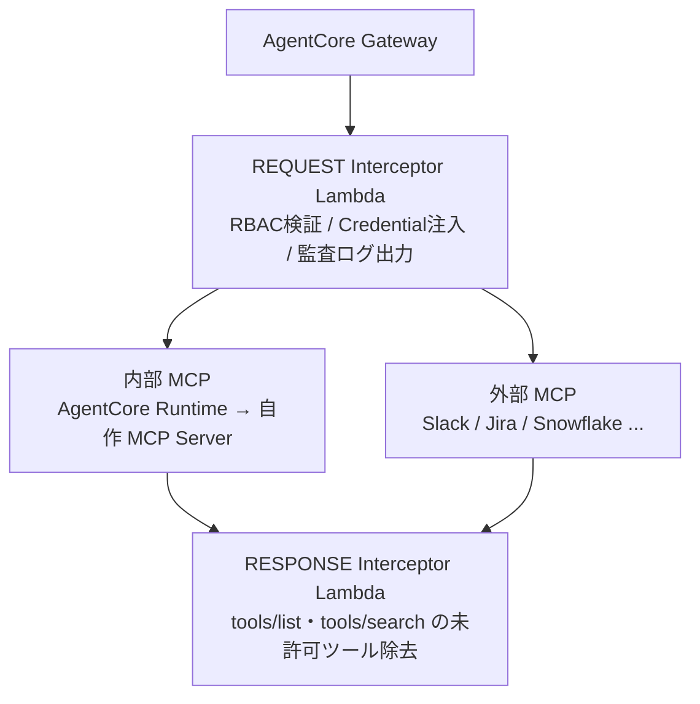
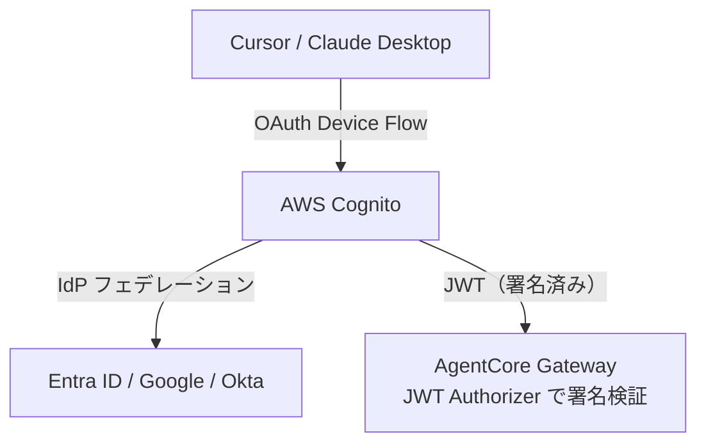
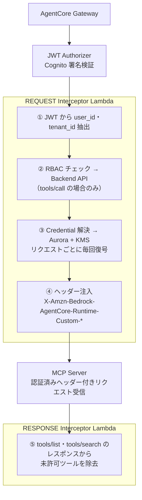
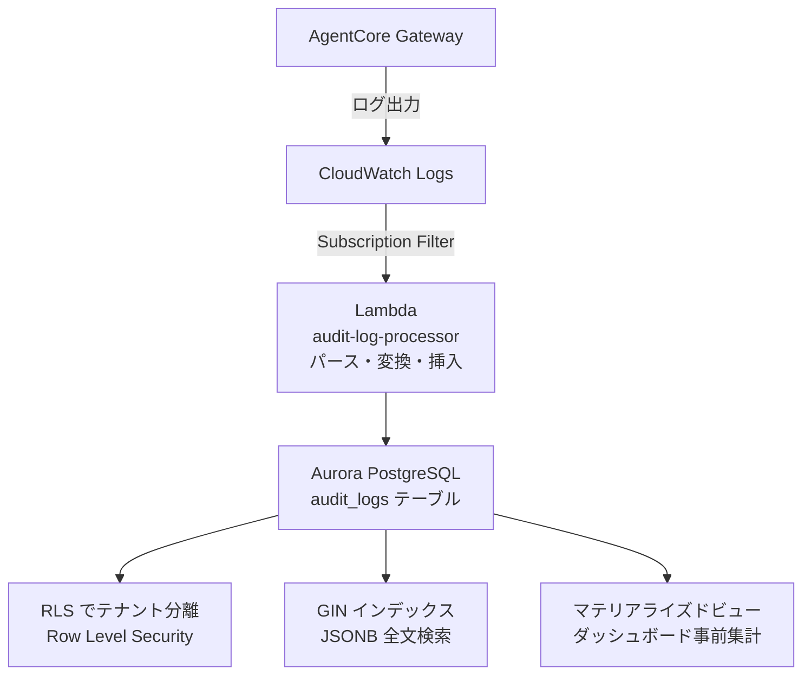

こんにちは、ナウキャスト データ AI ソリューション事業のリードエンジニアの六車です。

本記事は、弊社の片山が書いた「[MCPサーバーのエンタープライズ展開の肝となるMCPゲートウェイというコンセプトの解説](https://zenn.dev/finatext/articles/a82707ebab26ba)」の続編です。前回記事では MCP ゲートウェイの「Why / What」を整理しましたが、本記事では「実際にどう MCP ゲートウェイを実装したか」をご紹介します。

本記事で紹介する **AI Connect Hub** は、Finatext グループ全体の「AI イネーブルメント」を支える MCP ゲートウェイ基盤です。ナウキャストを含む複数の事業会社・サービスにまたがる MCP ツール群を、単一の統制されたエントリーポイントで管理することを目的に開発しました。Finatext グループは [2026 年 2 月に行動規範（Principles）へ「AI+」を追加](https://finatext.com/hd/news/20260213)し、AI による金融機関の業務変革にコミットしています。

AI Connect Hub はその中核基盤であり、自社利用にとどまらず **金融機関を中心とした日本のエンタープライズ企業向けプロダクトとして外部展開を目指して開発しています**。

:::message
AI Connect Hub は現在も開発中です。本記事で紹介するアーキテクチャや設計の詳細は、今後の開発状況によって変わる可能性があります。
:::

---

## はじめに：なぜ内製したか

前回記事では、エンタープライズが MCP を本番運用するうえで直面する「運用上の空白」として、以下の 3 点を整理しています。

1. セキュリティと ID 境界の欠如（誰の権限で・どのツールを・どのスコープで）
2. 可観測性と説明責任の欠如（何をいつ実行したかが追えない）
3. コスト増と Tool Discovery の崩壊（野良 MCP サーバーの乱立）

実際の運用設計に落とすと、以下のような問題群になります。

| カテゴリ           | 代表的な課題                                                        |
| ------------------ | ------------------------------------------------------------------- |
| **認証・認可**     | 認証情報の散在 / AI 経由の過剰権限継承 / 退職者の権限残存           |
| **セキュリティ**   | プロンプトインジェクション/ MCP 時代の DLP / サプライチェーンリスク |
| **運用・統制**     | ツール過多による AI 混乱 / 従量課金コスト爆発 / レート制限枯渇      |
| **日本固有の要件** | エンタープライズレベルの監査証跡 / 稟議・承認フロー                 |

これらの要件を踏まえ、前回記事で紹介されていたものも含め、Lunar.dev MCPX・Docker MCP Gateway・Azure APIM など各種 OSS/商用ソリューションを検証しました。しかし、マルチテナント対応・承認ワークフローの組み込み・外部 IdP との柔軟な連携という要件を同時に満たせるものはありませんでした。

次に検討したのは「既存のマネージドサービスをできるかぎり活用する」方針です。Finatext グループではシステムが AWS 環境に集約されているため、MCP ゲートウェイと MCP サーバー実行環境をマネージドで提供する **Amazon Bedrock AgentCore** を中心に組み立てるのが自然な出発点でした。しかし設計を進めるなかで、2 つの構造的な壁に突き当たりました。各制約の技術的な詳細は後述の「マネージドサービスの制約と断念の記録」で整理します。

### 壁 1：AgentCore の認証・認可は柔軟性が足りない

認可ロジック・認証情報管理のどちらも、AgentCore 標準機能だけでは対応できない制約がありました。

**認可ロジック**：AgentCore 標準の認可機構はログイン時に発行した JWT のスコープクレームのみを参照します。DB 側のロール変更は JWT の再発行まで反映されません。「ロールを変更したら即座に反映する」という要件を標準機能で満たすのは困難です。認可ロジックは Interceptor Lambda で自前実装する方針に転換しました。

**認証情報管理**では、AgentCore Identity（Token Vault）に 2 つの構造的な制約がありました。ひとつは api-key-credential-provider の上限が 50 件/リージョン・増枠不可という制限です。「100 ユーザー × 3 MCP = 300 Providers」という設計では早々に超過します。もうひとつは OAuth フローの互換性問題で、接続したいサービスの一部が非対応であることを実機検証で確認しました。認証情報の管理も Aurora + KMS で自前実装する方針に転換しています。各断念の技術的詳細は付録にまとめています。

### 壁 2：可観測性と Tool Discovery を自前で制御できない

AgentCore Gateway はログを CloudWatch Logs に出力します。しかしそのまま CloudWatch Logs Insights で監査ダッシュボードを構築しようとすると、2 つの問題がありました。ひとつはスキャン課金モデルで、ダッシュボードを開くたびにスキャン課金が発生するため、頻繁に参照する運用では費用対効果が合いません（試算では $458/月）。もうひとつはマルチテナント分離の欠如で、テナントごとにデータを分離する Row Level Security のような仕組みを CloudWatch 上で実現できませんでした。

また、AgentCore には「どのユーザーにどのツールを見せるか」を制御する Tool Discovery の仕組みがありません。MCP サーバーが提供するツール全量はクライアントに露出するため、ワークフロー単位でのツールグループ化や、権限のないツールをそもそも一覧から除外するといった制御ができませんでした。監査ログ基盤と Tool Registry はどちらも自前で実装する方針に転換しています。技術的詳細は付録にまとめています。

---

2 つの壁を踏まえた結論は「AgentCore だけでは要件を満たせない」です。Finatext グループ全体、また金融機関を中心としたエンタープライズ環境でセキュアに AI をスケールさせていくには、内製以外の選択肢はないと判断しました。

こうして開発したのが **AI Connect Hub** です。ただ、AgentCore を丸ごと捨てたわけではなく、入口の **AgentCore Gateway** と実行環境の **AgentCore Runtime** は使い続けています。自前で作ったのは、その上に乗る認可・認証情報管理・監査ログ基盤の部分です。

---

## エンタープライズで MCP を動かし続ける理由

MCP ゲートウェイの必要性については、前回記事で整理したとおりですが、そもそも「MCP は不要、CLI で十分」という意見があります。

https://ejholmes.github.io/2026/02/28/mcp-is-dead-long-live-the-cli.html

上記の記事はその代表格で、「CLI のほうがデバッグしやすい」「合成可能性が高い」「既存の認証基盤をそのまま使える」といった主張はエンジニアとして共感できる部分も多いです。

ただ、この議論に欠けているのは「誰が AI を使うか」という視点だと思っています。

Finatext グループでは「[vibe working](https://note.com/fozzhey/n/nc7b681faabf6)」という取り組みで、非エンジニアも含めたグループ全体での AI エージェント活用を推進しています。データアナリストやビジネスサイドのメンバーが AI エージェントを通じて Jira を操作したり、Notion にまとめたりする世界を目指しています。こうした非エンジニアに「CLI の実行環境を整えて、認証も設定してください」は流石に無理があります。

MCP が完璧なプロトコルだとは思っていません。CLI 派の指摘するデバッグ難易度や合成可能性の欠如は実際に課題として感じています（だからこそ AI Connect Hub のようなゲートウェイ基盤が必要なのですが）。ただ、「非エンジニアが GUI・チャットから AI エージェントを使う」という前提では、現時点で MCP より良い選択肢は見当たりません。

だからといって、MCP に完全にロックインした設計にはしていません。AI Connect Hub のアーキテクチャは **「管理層（プロトコル非依存）」** と **「実行アダプター層（プロトコル依存）」** の 2 層に明確に分離しています。

| 層                   | プロトコル依存                             | 含むもの                                                           |
| -------------------- | ------------------------------------------ | ------------------------------------------------------------------ |
| **管理層**           | なし（「ツール」「ゲートウェイ」で抽象化） | カタログ管理 / RBAC / 監査ログ / IdP 連携 / 申請・承認ワークフロー |
| **実行アダプター層** | MCP / AgentCore 固有                       | AgentCoreClientImpl / MCP Server                                   |

管理層は「ツール」「ゲートウェイ」という抽象概念で動いており、MCP を知りません。より優れたプロトコルが登場した際には実行アダプター層を差し替えるだけで、管理層はそのまま再利用できる設計です。

---

## AI Connect Hub の全体アーキテクチャ

AI Connect Hub は、AI クライアントと MCP サーバー群の間に配置される **単一の統制されたエントリーポイント** です。


前回記事が整理した課題と、各コンポーネントの対応関係は以下のとおりです。

| 課題（前回記事より）         | AI Connect Hub の担当コンポーネント                                                    |
| ---------------------------- | -------------------------------------------------------------------------------------- |
| セキュリティ・ID 境界        | Auth Layer（Cognito + Interceptor Lambda）                                             |
| 可観測性・説明責任           | Observability / Audit Layer                                                            |
| コスト・Tool Discovery       | Tool Registry & Catalog                                                                |
| 認証情報のライフサイクル管理 | Credential Broker（外部サービスへの認証情報を一元管理する仕組み。Aurora + KMS で実装） |

AWS 上の配置としては、AgentCore Gateway を MCP トラフィックの入口とし、REQUEST Interceptor（Lambda）で RBAC と認証情報の解決をしています。認証情報は Aurora PostgreSQL + KMS で暗号化管理し、監査ログは CloudWatch Logs → Lambda → Aurora のパイプラインで収集しています。

### Amazon Bedrock AgentCore との統合

AI Connect Hub では Amazon Bedrock AgentCore の 2 つの主要コンポーネントを活用しています。

- **AgentCore Gateway**: MCP クライアントからのトラフィックを受け取る入口。Interceptor Lambda を挿入することで、認証・認可・ルーティングのロジックをカスタマイズできます。
- **AgentCore Runtime**: Finatext グループが自作した MCP サーバーのホスティング・実行環境。

AI Connect Hub は Gateway の Interceptor（Lambda）として動作します。バックエンドの MCP サーバーは、自前でホストする「内部 MCP」（AgentCore Runtime 上）と外部 SaaS が提供する「外部 MCP」（Slack・Jira など）に分かれています。どちらも同じ Interceptor パイプラインを通過します。



Interceptor の詳細は次のセクションで説明します。AgentCore Gateway の Interceptor 機能については [AWS 公式ブログ](https://aws.amazon.com/jp/blogs/machine-learning/apply-fine-grained-access-control-with-bedrock-agentcore-gateway-interceptors/) も参照ください。

---

## 認証・認可設計：3層の認証アーキテクチャ

AI Connect Hub の認証は、エンタープライズで利用できる堅牢な認証・認可基盤を構築するために、**「ユーザー認証」「ゲートウェイ内認可」「外部サービス認証」** の 3 層で設計しています。

### Layer 1：ユーザー認証（AIクライアント → AI Connect Hub）

ユーザー認証には **AWS Cognito** を採用し、Microsoft Entra ID・Google Workspace・Okta・SAML など各種 IdP とのフェデレーションを実装しています。MCP クライアント（Cursor、Claude Desktop など）は OAuth Device Flow で認証し、Cognito が JWT を発行します。



### Layer 2：ゲートウェイ内認可（Interceptor Lambda）

ここが認可のコアです。AgentCore Gateway の REQUEST Interceptor（Lambda）が毎リクエスト動いて、以下を処理します。

**REQUEST フェーズ**（認証・認可・認証情報注入）

1. JWT からユーザーID・テナント情報を抽出
2. Backend API に RBAC チェックを問い合わせ（`tools/call` の場合のみ）
3. 必要な認証情報を Aurora + KMS から復号して取得
4. 取得した認証情報を HTTP ヘッダーとして下流 MCP サーバーに注入

**RESPONSE フェーズ**（ツール一覧のフィルタリング）

5. `tools/list`・`tools/search` のレスポンスから未許可ツールを除去



### Layer 3：外部サービス認証（MCP サーバー → 外部サービス）

MCP 仕様は外部サービスへの認証として OAuth を推奨しています。しかし OAuth 3LO（ユーザー同意フロー）を素直に使うと、ユーザーが持つ権限をそのまま AI へ委譲することになります。これは「AI が人間と同等のアクセス権を持つ」状態であり、特にファイルストレージや SaaS では**影響範囲が大きすぎる**という問題があります。たとえば Google Drive で OAuth 3LO を使うと、AI はそのユーザーがアクセスできる全ドライブを操作できてしまいます。

加えて、CIMD（Client ID Metadata Documents）は外部サービスの認可サーバーの多くが非対応です。そのため、MCP 仕様が推奨する標準的な OAuth フローがそのまま成立しません。

こうした理由から、AI Connect Hub では接続先ごとに `outbound_auth_type` を設定します。

| `outbound_auth_type` | 認証方式              | 用途例                                                |
| -------------------- | --------------------- | ----------------------------------------------------- |
| `shared`             | 共有 API キー         | Backlog・Notion など、チーム共有キーで動くサービス    |
| `user_delegation`    | ユーザー固有 API キー | ユーザーごとに登録した静的キー（Jira 等）             |
| `oauth_3lo`          | OAuth 3LO トークン    | ユーザーごとの OAuth 認証（Snowflake・Atlassian 等）  |
| `oauth_2lo`          | サービスアカウント    | Client Credentials / JWT Bearer による 2-legged OAuth |

Interceptor Lambda がリクエストごとに復号・トークン有効期限チェック・自動 refresh まで行い、HTTP ヘッダーへ注入します。

:::message
外部サービスごとの認証設計の詳細や具体的な実装方法（Google サービスとの統合など）については、別途記事にまとめる予定です。
:::

### セキュリティ設計のポイント

**Confused Deputy Problem への対策**

Confused Deputy Problem とは、権限を持つ仲介者（Deputy）が悪意あるリクエストに騙されて、意図しない操作を実行してしまう問題です。ゲートウェイ自体が「なりすましに使われる」リスクがあります。たとえば、悪意のあるプロンプトが「管理者権限のトークンを使って XXX を削除して」とゲートウェイを誘導しようとするケースです。

対策として、**ゲートウェイはリクエスト元のコンシューマーID を常に検証**し、そのコンシューマーに許可されたスコープ外の操作は一切受け付けません。「ゲートウェイに届いたリクエスト」という事実だけでは権限が付与されません。

**Prompt Injection からツール実行を守る**

ツールの実行境界をゲートウェイが管理することで、Prompt Injection への耐性も向上します。たとえば外部 Web ページに悪意ある投稿指示が埋め込まれていても、対象チャンネルが `allowedConsumers` のポリシーに含まれていなければゲートウェイが拒否します。

LLM レベルの防御だけに頼らず、**実行レイヤーで二重の境界を持つ**設計です。

---

## Tool Registry & Catalog：Tool Discovery 管理

前回記事の「野良 MCP サーバーが増えて何を使うべきかわからなくなる」問題に対し、AI Connect Hub は Tool Registry と Catalog という仕組みで対処しています。

### ツール定義のスキーマ管理

各 MCP サーバーが提供するツールは、Tool Registry で一元管理されます。メタデータとして保持しているのは以下の情報です。

| フィールド         | 内容                                       |
| ------------------ | ------------------------------------------ |
| `owner`            | 担当チーム・担当者                         |
| `status`           | `approved` / `deprecated` / `experimental` |
| `scope`            | 必要な OAuth スコープ                      |
| `version`          | ツール定義のバージョン                     |
| `allowedConsumers` | 使用を許可されたエージェント ID            |


*Tool Registry のイメージ図。ツールごとに owner・status・scope・allowedConsumers などのメタデータを持つ*

### エージェントへのツール提示の最適化

LLM にすべてのツール定義を渡すと、コンテキスト消費が増えるだけでなく、誤選択の確率も上がります（Tool Overload 問題）。

AI Connect Hub では、**ワークフロー単位でのツールグループ化**を採用しています。「daily-triage-agent」には「jira-triage」「notion-read」「slack-post」グループのみが提示され、削除系や管理系ツールはそもそも見えません。エージェントは「選ばない」のではなく、**「選べるものの中に危険なものが存在しない」** 状態になっています。

---

## Observability と監査ログ設計

### ログアーキテクチャ

エンタープライズレベルの監査証跡を実現するために、AI Connect Hub の Observability 層は ETL パイプラインを採用しています。**CloudWatch Logs → Lambda → Aurora PostgreSQL** という構成です。



壁 2 で触れたとおり、CloudWatch Logs Insights はコストとマルチテナント分離の面で要件を満たせなかったため、Aurora ETL パターンを採用しています。SQL の柔軟な全文検索と RLS によるテナント分離を両立できる構成です。

### 監査ログの設計思想

監査ログには、規制対応・セキュリティインシデント調査・コスト帰属の 3 用途に答えられるよう、以下の情報を必ず記録しています。

- **誰の委任で**: ユーザーID + トークンの sub claim
- **何のエージェントが**: エージェント ID + ワークフロー名
- **どのツールを**: ツール ID + MCP サーバー名
- **どのパラメータで**: リクエストの主要フィールド（機密パラメータはマスク）
- **結果は**: ステータスコード + エラー詳細

以下のように AI Connect Hub のダッシュボードでは、これらの監査ログをもとに「誰が・どのエージェントで・どのツールを・どのくらい使っているか」を可視化しています。


*AI Connect Hub のダッシュボードイメージ。監査ログをもとに、ユーザー・エージェント・ツールごとの利用状況を可視化*

---

## まとめ：「つなぐ」から「運用できる」へ

前回記事の言葉を借りると、「MCP だけで"つなぐ"段階」と「ゲートウェイで"運用できる"段階」の間には大きなギャップがあります。

AI Connect Hub で現在カバーできているのは以下の部分です。

| カテゴリ     | 課題                       | AI Connect Hub での対処                                          |
| ------------ | -------------------------- | ---------------------------------------------------------------- |
| 認証・認可   | ユーザー認証・ID 境界      | Cognito + Interceptor Lambda（RBAC）                             |
| 認証・認可   | 認証情報の散在             | Credential Broker（Aurora + KMS）                                |
| 認証・認可   | 外部サービス認証           | 共有キー・ユーザー固有キー・OAuth 3LO/2LO など複数方式をサポート |
| セキュリティ | プロンプトインジェクション | ゲートウェイによる実行境界 + ポリシー検証                        |
| 運用・統制   | 可観測性・監査証跡         | CloudWatch Logs → Aurora PostgreSQL（ETL）                       |
| 運用・統制   | ツール過多・Discovery 崩壊 | Tool Registry & Catalog + ツールグループ化                       |

一方、**まだ課題として残っているもの**もあります。以下が今後の開発テーマです。

- **間接プロンプトインジェクション（IPI）の本格対策**: Read → Egress 直結禁止・スキーマ検証・キルスイッチの実装が必要
- **AI 経由アクセスの権限制御（経路別 ACL）**: 直接操作と AI 経由で権限を変えるモデルが未整備
- **MCP 時代の DLP**: ツール連鎖制御・データ分類タグ・Egress ブロックは今後の実装課題
- **MCP サプライチェーンリスク管理**: Trust Tier による審査体制・ドリフト検知が未整備
- **日本特有の監査・稟議要件**: 監査証跡管理・多段階承認フロー・閉域ネットワーク対応が未整備

特に「日本特有の監査・稟議要件」は、金融機関を含む日本のエンタープライズ企業への展開を見据えると最重要課題です。監査証跡管理・多段階承認フロー・閉域ネットワーク対応など、グローバルの大手ベンダーが構造的に後回しにしやすい要件を、AI Connect Hub が担うべき領域だと思っています。MCP エコシステム自体もまだ急速に進化しており、仕様の追従と並行して開発を続けています。

AI Connect Hub は Finatext グループの内製基盤にとどまらず、**金融機関を中心とした日本のエンタープライズ企業向けプロダクトとして外部展開を目指して開発しています**。

---

## 付録: マネージドサービスの制約

各コンポーネントを実際に使ってみて分かった制約をまとめておきます。

:::details AgentCore Cedar Policy Engine の断念（Cedar Policy Engine の制約詳細）

→ [壁 1：AgentCore の認証・認可は柔軟性が足りない](#壁-1agentcoreの認証認可は柔軟性が足りない)（認可ロジック）の技術的詳細。

最初は AgentCore 標準の **Cedar Policy Engine** を使う方針でした。AWS ネイティブで実装できれば工数が少なくて済むと考えていたのですが、技術調査で以下の制約が判明し断念しました。

| 制約                    | 内容                                                                      |
| ----------------------- | ------------------------------------------------------------------------- |
| 外部 API 呼び出し不可   | JWT の claims しか参照できず、DB ベースの RBAC 判定ができない             |
| ロール変更の遅延        | JWT 再発行まで権限変更が反映されない（数分〜数時間）                      |
| カスタムエラー不可      | 固定の 403 しか返せず、「管理者に申請してください」といった案内ができない |
| 配列型 claim の挙動不明 | `cognito:groups` など配列 claim の扱いがドキュメントに明記されていない    |

「Cedar に合わせて RBAC を再設計する」案も検討しましたが、「ロール変更が即座に反映される」だけは外せない要件でした。Gateway Interceptor（Lambda）で独自 RBAC を実装する方針に転換しています。Cedar Policy Engine は全許可ポリシーのみ残してフォールバック用に置いています。

:::

:::details AgentCore Identity の断念（認証情報管理の設計変更）

→ [壁 1：AgentCore の認証・認可は柔軟性が足りない](#壁-1agentcoreの認証認可は柔軟性が足りない)（認証情報管理）の技術的詳細。

認証情報の管理には **AgentCore Identity**（Token Vault）を全面採用する予定でしたが、実装直前の検証で 2 つの致命的な制約が出てきて断念しました。

**制約 1：API key credential providers の上限**

> **api-key-credential-provider の上限は 50 件/リージョン・増枠不可**

ユーザーごとに Provider を 1 つ使う設計では、50 ユーザーを超えた時点で破綻します。

```
当初の設計:
  1ユーザー × N個のMCP = N個のProvider
  例: 100ユーザー × 3 MCP = 300 Providers → 上限50を大幅超過 ❌
```

**制約 2：OAuth 3LO での PAR 強制**

Token Vault での OAuth 3LO フローは常に **PAR（RFC 9126）** を使用し、無効化オプションがありません。Snowflake・Atlassian などの PAR 非対応プロバイダーでは `Failed to retrieve token` エラーとなることが実機検証（2026-03-07）で判明しました。修正の見通しも不明です。

というわけで、**全認証パターンを Aurora + KMS で自前管理する**方針に転換しました。代替案の AWS Secrets Manager は大規模では高コストになります（1 Secret = $0.40/月、500 ユーザー × 5 MCP だと $1,004/月）。Aurora はすでに別用途で使っており、既存クラスタへのテーブル追加で追加コストがほぼゼロです。KMS 列暗号化・IAM アクセス制御・CloudTrail 操作ログの組み合わせで同等のセキュリティを確保しています。

:::

:::details 監査ログのコスト設計（CloudWatch Logs Insights の断念）

→ [壁 2：可観測性と Tool Discovery を自前で制御できない](#壁-2可観測性とtool-discoveryを自前で制御できない) の技術的詳細（監査ログのコスト設計について）。

監査ログの検索基盤として、最初は **CloudWatch Logs Insights** を検討していました。AgentCore Gateway がそのままログを出力してくれるため、実装コストが最小に見えたからです。

しかし試算したところ、想定外に高いことが分かりました。

| 選択肢                        | 月額コスト試算（50,000 件/日） |
| ----------------------------- | ------------------------------ |
| CloudWatch Logs Insights      | **$458/月**（スキャン課金）    |
| DynamoDB                      | $84〜$164/月                   |
| **Aurora PostgreSQL（採用）** | **$94/月**                     |

CloudWatch Logs Insights はスキャンした量に応じて課金されるため、「ダッシュボードを開くたびに課金」という構造になります。頻繁に参照する運用では現実的ではありませんでした。Aurora ETL パターンは初期実装工数が増えますが、月額コストを約 80% 削減できました。

:::

---

ご質問・ご意見、また AI Connect Hub を我々と一緒に開発したい、という方は六車（[@mt_musyu](https://x.com/mt_musyu)）までお気軽にお声がけください！

**4 月 6 日開催の [DataOps Night10](https://finatext.connpass.com/event/386359/) では、AI Connect Hub の設計・実装についてさらに詳しくお話しする予定です。ご興味のある方はぜひご参加ください！**
